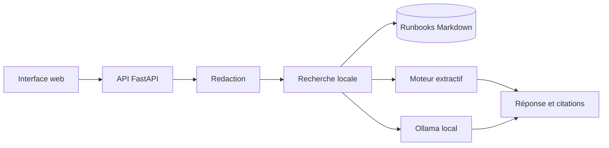

# Local Runbook RAG

Assistant SRE local pour interroger des runbooks techniques, retrouver les procédures pertinentes et produire une réponse structurée avec ses sources.

Le projet fonctionne sans cloud et sans modèle grâce à un moteur extractif déterministe. Lorsqu’**Ollama** est disponible, il synthétise les extraits retrouvés avec `qwen3:8b`. Les commandes sont uniquement suggérées : l’application ne possède aucun accès à l’infrastructure et n’exécute aucune action.

> Tous les runbooks fournis sont fictifs. Ne placez jamais de documentation interne ou de données de production dans un dépôt public.

## Fonctionnalités

- Ingestion automatique de runbooks Markdown.
- Recherche locale légère, sans base de données obligatoire.
- Génération avec Ollama et repli automatique vers une réponse extractive.
- Citations avec fichier, section, extrait et score.
- Masquage des e-mails, adresses IP et secrets courants.
- Réponses structurées : résumé, vérifications, commandes et avertissements.
- Trois runbooks synthétiques : Kubernetes, Kafka et Linux.
- Interface web responsive, API FastAPI et documentation OpenAPI.
- Tests indépendants d’Ollama, Docker et CI GitHub Actions.

## Architecture



Voir [docs/architecture.md](docs/architecture.md) pour le flux détaillé et les limites.

## Démarrage rapide

### Prérequis

- Python 3.11 ou plus récent
- Ollama facultatif, actif sur `http://localhost:11434`
- `qwen3:8b` ou un modèle compatible pour la synthèse locale

```bash
ollama pull qwen3:8b
```

### Installation locale

```bash
python3 -m venv .venv
source .venv/bin/activate
pip install -e '.[dev]'
cp .env.example .env
uvicorn app.main:app --reload
```

Ouvrir [http://localhost:8000](http://localhost:8000). L’API OpenAPI est disponible sur [http://localhost:8000/docs](http://localhost:8000/docs).

En l’absence d’Ollama, le mode `auto` utilise automatiquement la réponse extractive.

### Docker

Ollama reste installé nativement sur le Mac pour profiter de Metal. Seule l’application est conteneurisée et son port est lié à `127.0.0.1`.

```bash
cp .env.example .env
docker compose up --build
```

## Exemple d’API

```bash
curl http://localhost:8000/api/query \
  -H 'Content-Type: application/json' \
  -d '{
    "question": "Mon pod redémarre avec CrashLoopBackOff. Que vérifier ?",
    "engine": "auto",
    "top_k": 3
  }'
```

Réponse abrégée :

```json
{
  "summary": "Vérifier les événements et les logs du conteneur précédent.",
  "checks": ["Identifier le conteneur en échec"],
  "commands": ["kubectl describe pod -n <namespace> <pod>"],
  "warnings": ["Valider chaque commande avant exécution."],
  "citations": [
    {
      "source": "kubernetes-crashloop.md",
      "section": "Vérifications en lecture seule"
    }
  ],
  "confidence": 0.78,
  "engine": "ollama"
}
```

## Ajouter un runbook

Ajoutez un fichier `.md` dans `runbooks/`. Le titre `#` devient le nom du runbook et chaque section `##` devient une unité de recherche.

Bonnes pratiques :

- décrire les symptômes avant les actions ;
- séparer les vérifications en lecture seule des changements ;
- placer les commandes dans des blocs `bash` ;
- documenter les critères d’escalade ;
- ne jamais inclure de secrets ou de données réelles.

## Configuration

| Variable | Défaut | Rôle |
|---|---|---|
| `OLLAMA_BASE_URL` | `http://localhost:11434` | URL de l’API Ollama |
| `OLLAMA_MODEL` | `qwen3:8b` | Modèle de synthèse |
| `RAG_ENGINE` | `auto` | `auto`, `ollama` ou `extractive` |
| `RUNBOOKS_PATH` | `runbooks` | Répertoire documentaire |
| `MAX_QUESTION_LENGTH` | `2000` | Taille maximale prévue |

## Tests

```bash
pytest
```

Les tests utilisent le moteur extractif et ne contactent ni Ollama ni Internet.

## Limites et sécurité

- La recherche lexicale ne comprend pas les synonymes absents des documents.
- Le score de confiance n’est pas une probabilité calibrée.
- Le masquage automatique ne remplace pas une revue des données.
- Une réponse générée peut être incomplète : vérifiez toujours les citations.
- Aucune commande n’est exécutée par le projet.

Voir [SECURITY.md](SECURITY.md).

## Feuille de route

- Ajouter des embeddings locaux et comparer leur qualité au moteur lexical.
- Versionner un jeu de questions pour mesurer rappel et fidélité des citations.
- Importer des runbooks depuis un dossier choisi, sans copie dans le dépôt.
- Exporter un plan de diagnostic en Markdown.
- Ajouter OpenTelemetry pour mesurer recherche et génération.

## Licence

MIT — voir [LICENSE](LICENSE).
