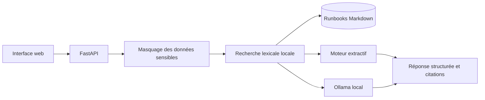

# Architecture

La recherche lexicale est le socle déterministe du projet. Elle ne nécessite ni service externe ni téléchargement de modèle. Le générateur Ollama est optionnel : en mode `auto`, une indisponibilité provoque un retour vers le moteur extractif.

## Flux de données

1. La question est limitée en taille et les e-mails, IP et secrets courants sont masqués.
2. Les sections Markdown sont classées localement selon les termes de la question.
3. Les extraits retenus sont soit synthétisés par Ollama, soit présentés par le moteur extractif.
4. Chaque réponse conserve ses sources, son moteur et un niveau de confiance.

## Limites de confiance

Le score de confiance est un indicateur produit par l’application, pas une probabilité calibrée. Il ne remplace ni l’observation du système ni la validation d’un opérateur.
